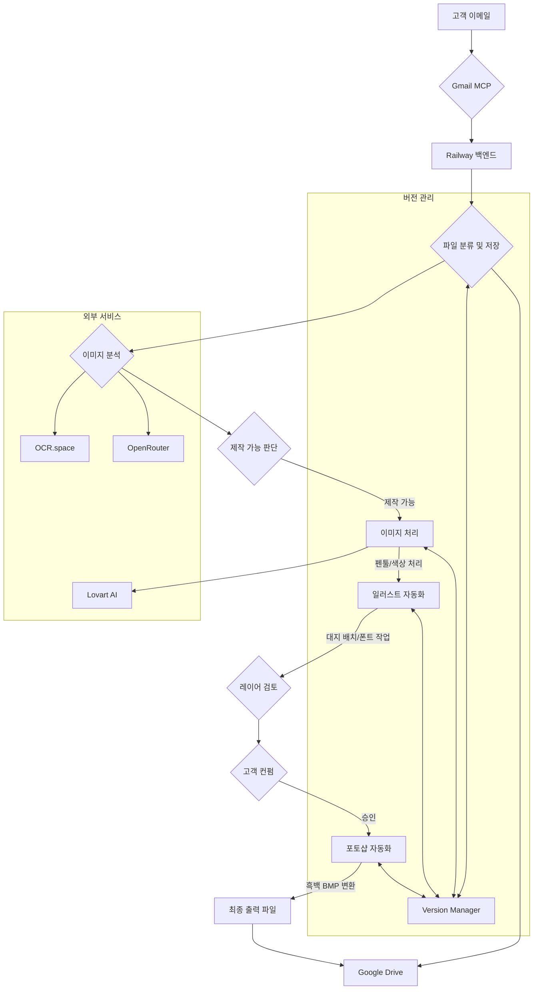

# Madstamp 도장 이미지 자동화 시스템 - POD (Product Outline Document)

**버전**: 3.0  
**작성일**: 2025년 12월 27일  
**사업자등록번호**: 880-86-02373  
**소유**: Madstamp  

---

## 1. 프로젝트 개요

### 1.1. 프로젝트 목적

고객의 이메일 요청부터 최종 레이저 프린터 출력까지, 도장 제작의 **전체 워크플로우를 자동화**하는 것을 목표로 합니다. 이 시스템은 고객이 보낸 다양한 형태의 이미지를 자동으로 분류 및 분석하고, 제작 가능 여부를 판단하며, 필요시 Lovart AI로 이미지를 생성합니다. 이후 일러스트레이터와 포토샵 자동화를 통해 도장 제작에 최적화된 흑백 BMP 파일을 생성하고, 모든 과정을 Google Drive에 체계적으로 기록 및 관리합니다.

### 1.2. 핵심 가치

| 항목 | 기존 방식 | 자동화 시스템 |
|---|---|---|
| **파일 관리** | 수동 분류 및 저장 | 주문별 자동 분류, Google Drive 동기화 |
| **이미지 분석** | 수동 확인 (10-30분) | AI 자동 분석 (30초) |
| **디자인 작업** | 수동 (Illustrator/Photoshop) | 스크립트 기반 자동화 (배치, 변환) |
| **고객 응답 시간** | 1-24시간 | 5분 이내 (1차 분석) |
| **오류 발생률** | 높음 (폰트, 색상, 선처리) | 최소화 (자동화된 규칙 적용) |
| **버전 관리** | 수동 (파일명 의존) | 체계적인 버전 관리 시스템 |

### 1.3. 대상 사용자

- **1차 사용자**: GOOPICK 내부 운영팀 (goopick@goopick.net)
- **최종 사용자**: 도장 제작을 요청하는 고객

---

## 2. 시스템 아키텍처 (v3.0)

### 2.1. 전체 워크플로우



### 2.2. 기술 스택

| 역할 | 기술 | 용도 |
|---|---|---|
| **파일 관리** | Python, rclone | 파일 분류, Google Drive 동기화 |
| **이미지 분석** | OpenRouter Grok 4.1 Fast | 비전 AI 분석, 제작 가능 여부 판단 |
| **OCR** | OCR.space (무료) | 이미지 내 텍스트 추출 |
| **이미지 생성** | Lovart AI (Playwright) | 4K 도장 이미지 생성 |
| **디자인 자동화** | **AppleScript / JSX** | **Adobe Illustrator/Photoshop 제어** |
| **이미지 처리** | OpenCV, Pillow | 흑백 변환, 선 최적화 |
| **벡터 변환** | Potrace, Inkscape | PNG → SVG → EPS/AI |
| **데이터베이스** | Supabase (PostgreSQL) | 주문 및 버전 이력 관리 |
| **서버** | Railway / Docker | 자동화 파이프라인 호스팅 |

---

## 3. 핵심 기능 (확장)

### 3.1. 파일 분류 및 버전 관리

- **파일명 규칙**: `[OrderID]_[Stage]_[VersionID].[ext]`
  - 예: `MS202512271030_03-processed_v202512271035_a1b2c3.png`
- **Google Drive 구조**: `Madstamp/Orders/[OrderID]/[Stage]/[Filename]`
- **버전 관리**: 모든 생성/수정 파일은 `version_manager.py`를 통해 이력을 추적하고 `metadata.json`에 기록합니다.

### 3.2. 이미지 처리 (도장 최적화)

- **흑백 변환**: 컬러 이미지를 1-bit 흑백 이미지로 변환합니다.
- **선 처리**: 펜툴 효과를 시뮬레이션하여 도장 날인에 적합한 명확한 선으로 만듭니다.
- **색 비우기**: 도장에서 파여야 할 부분을 흰색으로 처리합니다.
- **오류 개선**: AI 분석을 통해 불필요한 노이즈, 깨진 선 등을 자동으로 보정합니다.

### 3.3. Adobe 자동화

- **일러스트레이터 (IllustratorAutomator)**:
  1. **대지 설정**: 고객 요청 사이즈로 대지(Artboard) 생성
  2. **이미지 배치**: 처리된 이미지를 대지 중앙에 배치
  3. **폰트 작업**: OCR로 추출된 텍스트를 지정된 폰트로 타이핑 및 배열
  4. **레이어 관리**: 이미지, 텍스트, 외곽선 레이어를 자동으로 분리하고 명명
  5. **AI/EPS 저장**: 작업 완료 후 벡터 파일로 저장

- **포토샵 (PhotoshopConverter)**:
  1. 최종 승인된 AI/EPS 파일 열기
  2. **흑백 BMP 변환**: 레이저 프린터 출력에 최적화된 1-bit Monochrome BMP 형식으로 변환
  3. **해상도 설정**: 600 DPI 이상으로 설정

### 3.4. 원본/수정본 관리

- **원본 보존**: 고객이 보낸 원본 파일은 `01_original` 폴더에 변경 없이 영구 보존됩니다.
- **수정본 관리**: 각 처리 단계(processed, illustrator, final_bmp 등)의 결과물은 별도의 버전으로 저장되어 추적이 가능합니다.
- **최종 파일**: 고객 컨펌이 완료된 파일은 `06_approved` 단계로 이동하며, 이를 기반으로 최종 BMP 파일이 생성됩니다.

---

## 4. GitHub 저장소 구조 (확장)

**저장소**: `MadKangYu/madstamp-automation`

```
madstamp-automation/
├── app/
│   ├── jobs/
│   │   ├── file_manager.py          # 파일 분류, GDrive 연동
│   │   ├── illustrator_automator.py # 일러스트 자동화
│   │   ├── image_processor.py       # 이미지 처리, 흑백 변환
│   │   ├── photoshop_converter.py   # 포토샵 BMP 변환
│   │   └── version_manager.py       # 버전 관리 시스템
│   └── main.py                      # 전체 파이프라인 (확장)
├── db/
│   └── schema.sql                   # Supabase 스키마 (확장)
├── docs/
│   ├── POD_FINAL_V3.md            # 이 문서
│   └── SYSTEM_ARCHITECTURE_V3.md
└── ... (기존 구조 동일)
```

---

## 5. 실행 계획

### Phase 1 (완료)
- [x] 전체 시스템 재설계 (v3.0)
- [x] 파일 관리 및 버전 관리 시스템 개발
- [x] Adobe 자동화 모듈 개발
- [x] 이미지 처리 및 BMP 변환 모듈 개발
- [x] 전체 파이프라인 통합 및 GitHub 업데이트

### Phase 2 (예정)
- [ ] Supabase 데이터베이스 연동 강화 (버전 이력 저장)
- [ ] Railway 서버 배포 및 안정화
- [ ] 고객 컨펌 응답 자동 처리 (이메일 회신 분석)

---

*이 문서는 확장된 워크플로우를 반영하여 업데이트되었습니다.*
