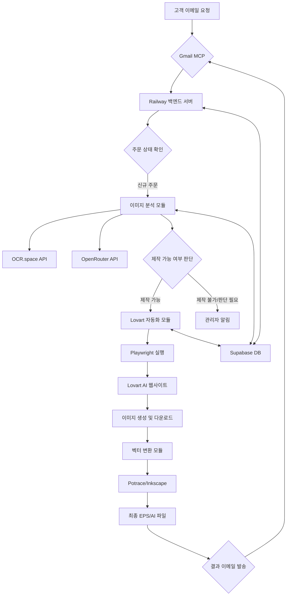

# Madstamp 자동화 시스템: 전체 아키텍처 및 네이밍 컨벤션

## 1. 최종 시스템 아키텍처

본 시스템은 고객의 이메일 요청을 자동으로 처리하여, 첨부된 이미지를 분석하고, Lovart AI를 통해 도장 이미지를 생성한 후, 최종 결과물을 고객에게 다시 이메일로 전달하는 것을 목표로 합니다.

### 1.1. 시스템 구성도



### 1.2. 기술 스택

| 역할 | 기술 | 비용 | 이유 |
|---|---|---|---|
| **백엔드 서버** | Railway (Python) | 무료~ | Playwright 실행 환경, 간편한 배포 |
| **데이터베이스** | Supabase (PostgreSQL) | 무료 | 충분한 무료 티어, 스토리지/인증 포함 |
| **브라우저 자동화** | Playwright | 무료 | 로그인 세션 유지, 복잡한 UI 제어 |
| **이미지 분석** | OpenRouter (Grok-4.1-fast) | 종량제 | 다중 모달 입력, 제작 가능성 판단 |
| **OCR** | OCR.space | 무료 | 넉넉한 무료 API 호출 횟수 |
| **이미지 생성** | Lovart AI | 구독 | 사용자 지정 이미지 생성 |
| **벡터 변환** | Potrace / Inkscape | 무료 | PNG to EPS/AI 변환 |
| **이메일 연동** | Gmail MCP | 무료 | 안정적인 이메일 송수신 |

---

## 2. GitHub 저장소 구조 및 네이밍 컨벤션

- **저장소명**: `madstamp-automation`
- **기본 브랜치**: `main`
- **개발 브랜치**: `develop`
- **기능 브랜치**: `feat/feature-name` (예: `feat/image-analyzer`)

### 2.1. 디렉토리 구조

```
madstamp-automation/
├── .github/                # GitHub Actions 워크플로우
│   └── workflows/
│       └── main.yml
├── .vscode/                # VSCode 설정
│   └── settings.json
├── app/                    # 핵심 애플리케이션 로직
│   ├── __init__.py
│   ├── main.py             # 애플리케이션 진입점 (FastAPI)
│   ├── core/               # 핵심 설정, 로깅
│   │   ├── __init__.py
│   │   └── config.py
│   ├── services/           # 비즈니스 로직 서비스
│   │   ├── __init__.py
│   │   ├── order_service.py
│   │   └── email_service.py
│   ├── models/             # 데이터베이스 모델 (Pydantic)
│   │   ├── __init__.py
│   │   └── order.py
│   ├── apis/               # 외부 API 클라이언트
│   │   ├── __init__.py
│   │   ├── openrouter_client.py
│   │   └── ocr_space_client.py
│   └── jobs/               # 백그라운드 작업 (Playwright, 변환)
│       ├── __init__.py
│       ├── lovart_automator.py
│       └── vector_converter.py
├── db/                     # 데이터베이스 관련 파일
│   ├── migrations/         # Supabase 마이그레이션
│   └── schema.sql          # 전체 DB 스키마 정의
├── docs/                   # 프로젝트 문서
│   ├── SYSTEM_ARCHITECTURE.md
│   └── POD.md
├── scripts/                # 보조 스크립트
│   └── setup_fonts.py
├── tests/                  # 테스트 코드
│   ├── __init__.py
│   └── test_order_service.py
├── .env.example            # 환경변수 템플릿
├── .gitignore              # Git 제외 파일 목록
├── Dockerfile              # Docker 빌드 파일
├── poetry.lock             # 의존성 잠금 파일
├── pyproject.toml          # Python 프로젝트 설정 (Poetry)
└── README.md               # 프로젝트 개요
```

### 2.2. 파일 및 변수 네이밍 컨벤션

- **Python 파일**: `snake_case.py` (예: `order_service.py`)
- **클래스**: `PascalCase` (예: `OrderService`)
- **함수/메서드**: `snake_case()` (예: `create_new_order()`)
- **변수/상수**: `snake_case` / `UPPER_SNAKE_CASE` (예: `order_id` / `MAX_RETRIES`)

---

## 3. Supabase 데이터베이스 네이밍 컨벤션

- **테이블**: 복수형, `snake_case` (예: `orders`, `generated_images`)
- **컬럼**: 단수형, `snake_case` (예: `customer_id`, `created_at`)
- **기본 키**: `id` (UUID)
- **외래 키**: `[참조테이블단수형]_id` (예: `order_id`)
- **인덱스**: `idx_[테이블명]_[컬럼명]` (예: `idx_orders_status`)

---

## 4. API 엔드포인트 네이밍 컨벤션 (RESTful)

- **버전**: `/api/v1`
- **리소스**: 복수형, `kebab-case` 사용 지양 (예: `/orders`)
- **경로**: `GET /orders`, `GET /orders/{order_id}`, `POST /orders`, `PATCH /orders/{order_id}`

이 문서는 프로젝트의 일관성을 유지하고 협업을 용이하게 하기 위한 청사진입니다. 모든 개발은 이 가이드라인을 따릅니다.
