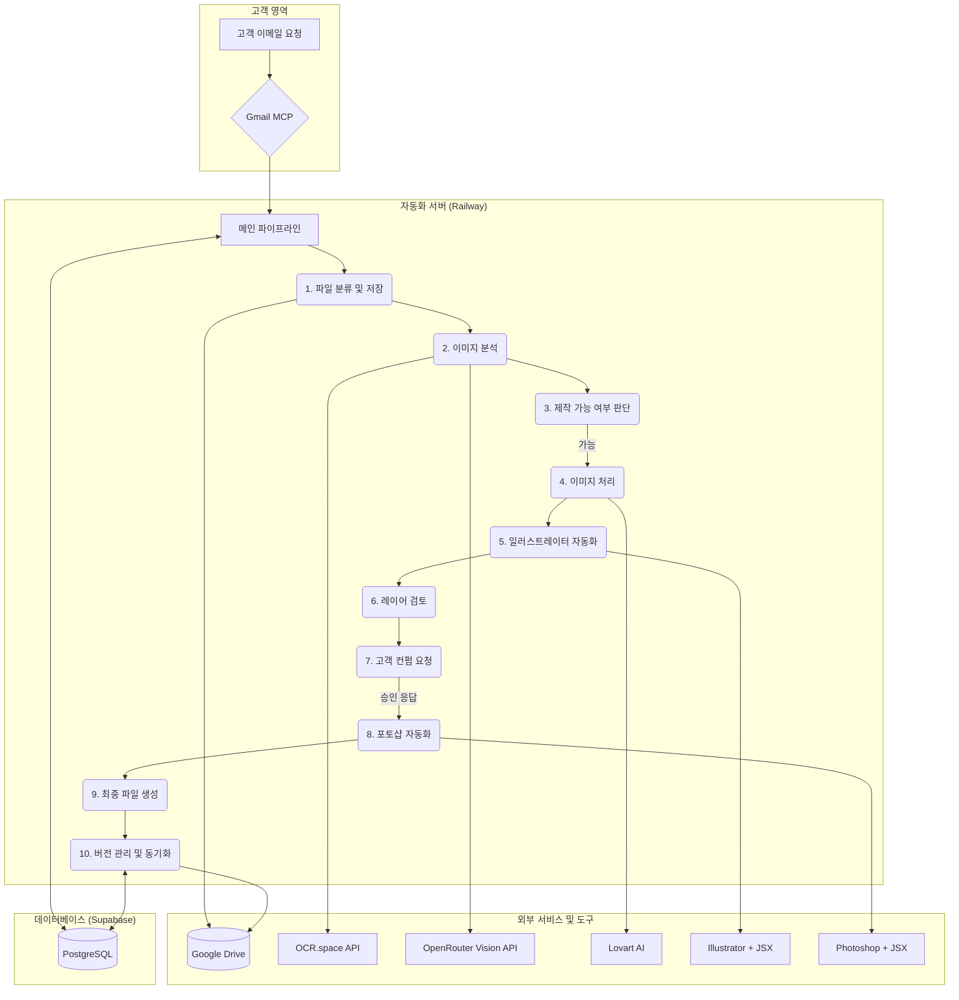

# Madstamp 자동화 시스템: 전체 아키텍처 (v3.0)

**버전**: 3.0  
**작성일**: 2025년 12월 27일  

---

## 1. 최종 시스템 아키텍처

본 시스템은 고객의 이메일 요청부터 최종 레이저 프린터 출력까지, 도장 제작의 **전체 워크플로우를 자동화**하는 것을 목표로 합니다. Adobe Illustrator/Photoshop 자동화, Google Drive 연동, 체계적인 버전 관리가 포함된 확장된 아키텍처입니다.

### 1.1. 시스템 구성도

### 1.2. 기술 스택

| 역할 | 기술 | 용도 및 이유 |
|---|---|---|
| **파일 관리** | Python, rclone | 주문별 파일 자동 분류, Google Drive 동기화 |
| **디자인 자동화** | **AppleScript / JSX** | **Adobe Illustrator/Photoshop 제어** (macOS 환경 필요) |
| **이미지 처리** | OpenCV, Pillow | 흑백 변환, 선 최적화, 노이즈 제거 |
| **이미지 분석** | OpenRouter Grok 4.1 Fast | 비전 AI 분석, 제작 가능 여부 판단 |
| **OCR** | OCR.space (무료) | 이미지 내 텍스트 추출 |
| **이미지 생성** | Lovart AI (Playwright) | 4K 고해상도 도장 이미지 생성 |
| **벡터 변환** | Potrace, Inkscape | PNG → SVG → EPS/AI 변환 |
| **데이터베이스** | Supabase (PostgreSQL) | 주문, 고객, 파일 버전 이력 관리 |
| **서버** | Railway / Docker | 자동화 파이프라인 호스팅 |
| **이메일 연동** | Gmail MCP | 이메일 모니터링 및 자동 응답 |

---

## 2. 데이터 흐름 및 버전 관리

1.  **수신 (`01_original`)**: 고객 이메일의 첨부 파일은 `[OrderID]/01_original`에 저장됩니다.
2.  **분석 (`02_analyzed`)**: 이미지 분석 결과(JSON)와 로그가 저장됩니다.
3.  **처리 (`03_processed`)**: 흑백 변환 및 최적화된 PNG 파일이 저장됩니다.
4.  **일러스트 (`04_illustrator`)**: 자동 생성된 AI, EPS 파일이 저장됩니다.
5.  **검토 (`05_review`)**: 내부 검토용 PNG 미리보기 파일이 저장됩니다.
6.  **승인 (`06_approved`)**: 고객이 승인한 버전의 파일이 보관됩니다.
7.  **최종 (`07_final_bmp`)**: 레이저 프린터 출력용 1-bit 흑백 BMP 파일이 저장됩니다.

모든 단계의 파일은 **`version_manager.py`** 를 통해 버전 ID가 부여되고, `metadata.json`에 기록되며, Google Drive에 실시간으로 동기화됩니다.

---

## 3. Adobe 자동화 구현

-   **실행 환경**: Adobe Creative Cloud 앱을 제어하기 위해 이 모듈은 **macOS 환경**에서 실행되어야 합니다. (AppleScript/JXA 지원 필요)
-   **실행 방식**: 메인 파이프라인(Railway)이 SSH 또는 API를 통해 macOS 실행기(Runner)에 작업을 요청하는 방식으로 구성됩니다.
-   **스크립트**: 각 작업(대지 설정, 텍스트 입력, BMP 변환 등)은 재사용 가능한 JSX(ExtendScript) 파일로 모듈화됩니다.

이 문서는 확장된 워크플로우를 반영하여 업데이트되었습니다.
